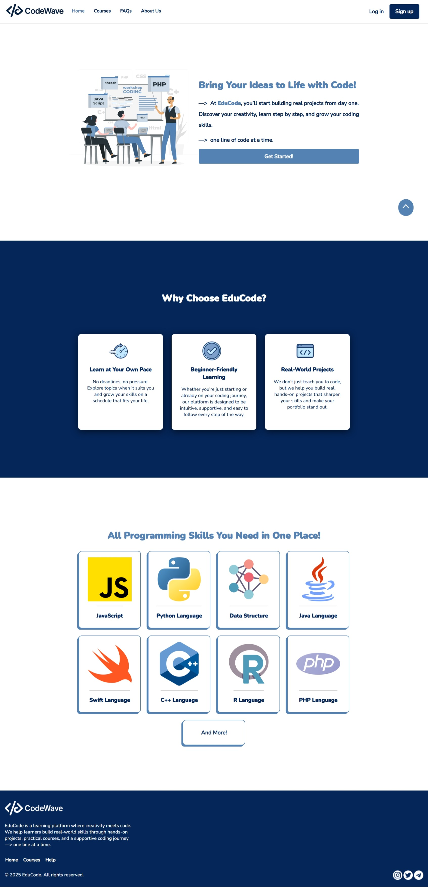
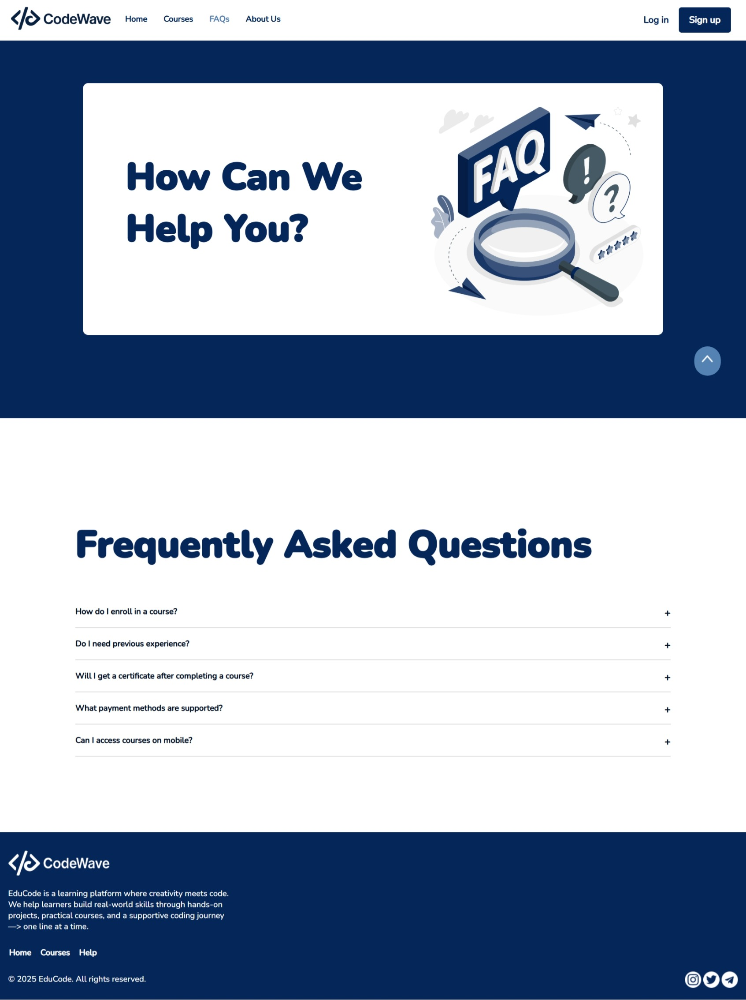

## **CodeWave Website**

Developed the Home and FAQ pages as part of a full-stack educational website, focusing on the front-end using HTML and CSS.
Contributed to a team-based system that includes admin and student dashboards, with backend and database components implemented by other team members.

---

### ✏️ My Work:
- Designed and built the **Home** and the **FACs (Frequently Asked Questions)** Pages

### 🔍 Focused on:
  - Clean layout  
  - Responsive design  
  - Easy navigation

  ### 🔧 Tools:
- HTML  
- CSS

---

### 📸 Images:

- **Home Page**

- **FAQs Page**

